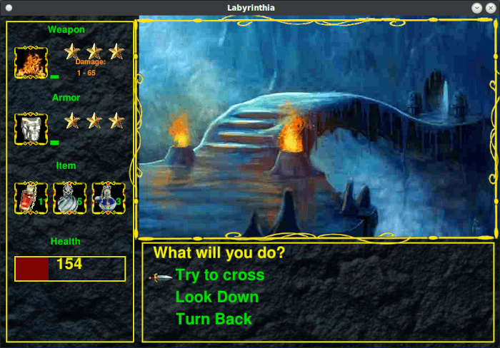

<h1>Labyrinthia</h1>
<h3>Dependencies</h3>
<ul><li>Python</li>
  <li>PyGame</li></ul>
<h3>Description</h3>

This is one of my first big programing projects from when I started learning to code in Python.
I created this game before I started my software engineering degree, so I am not going to claim
best coding practices were used (good documentation, code reuse, etc.) Overall, I spent probably 
6-9 months working on it for several hours per day. I probably spent just as much time editing 
pictures and sound files as coding.

DISCLAIMER: Almost all of the audio and visual content is completely ripped off. I mostly 
searched google for the content but you may recognize the music and sound effects from 
1990s games like The Legend of Zelda, Arcana, Metroid, and other popular games from that era. The 
picture files were downloaded from Google and modified by myself and my wife, who was a 
great help with this project.

Note: This entire project was created stricty for academic purposes and should not be 
used for any sort of financial gain.

<h3>Screen Shots</h3>

